# Returning-an-XML-in-the-Message-Body
SAP BTP CPI - Retornando um XML no Corpo da Mensagem

Returning an XML Payload do Postman in the Message Body 


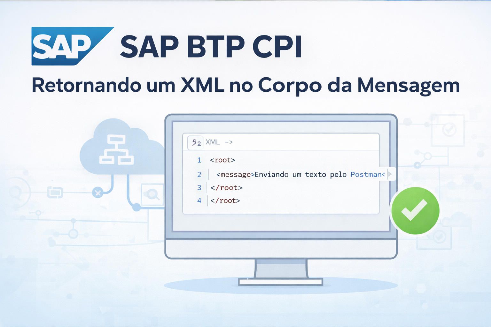


📊 Exemplo Prático do Fluxo

### Criando nosso Iflow


### Adicionando o nome para nosso Pacote
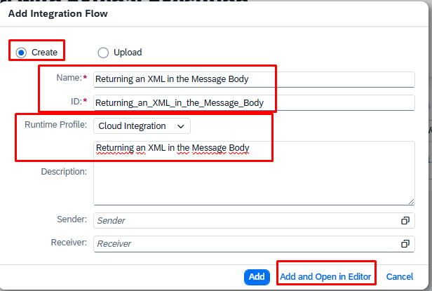

### Criando nosso Artefato do iFlow
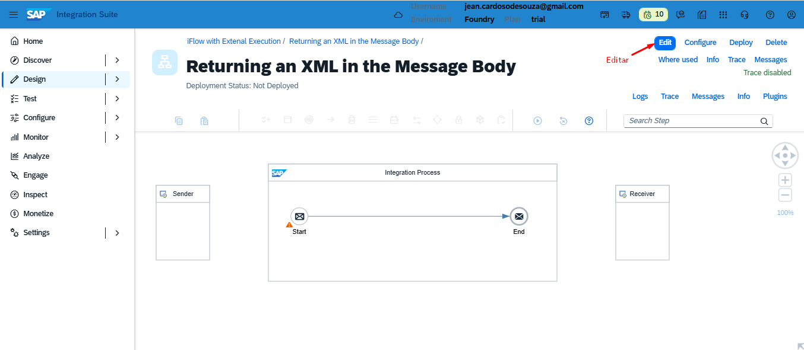

### Adicionando o Integration Flow
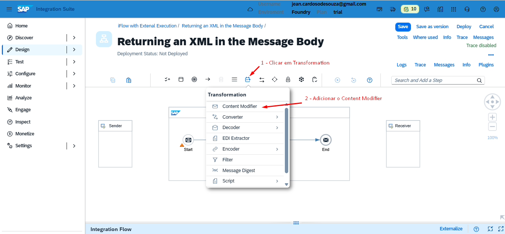

### Editando nosso Iflow
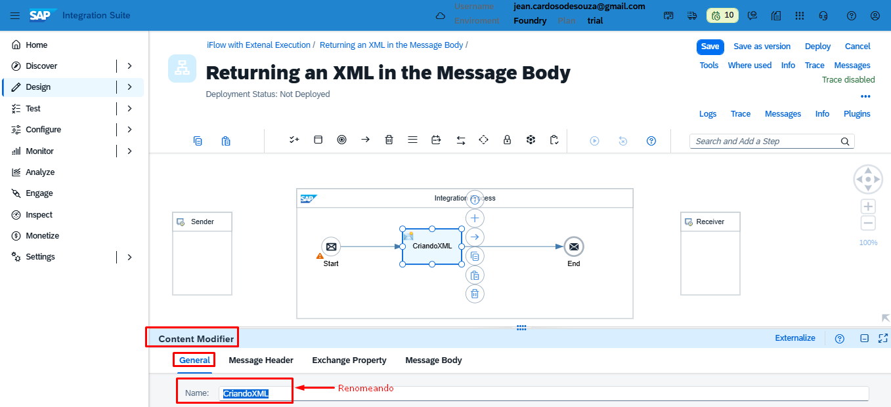

### Removendo o Sender do nosso iFlow
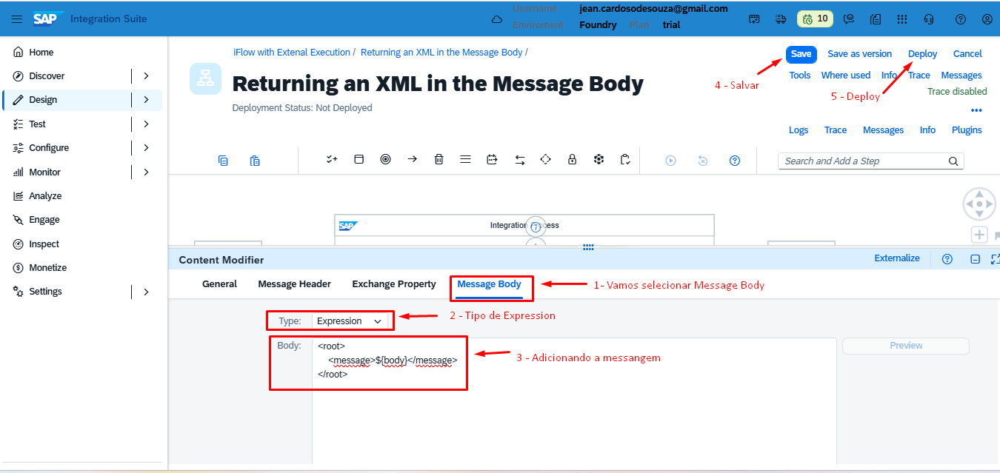

### Removendo o Receiver do nosso iFlow
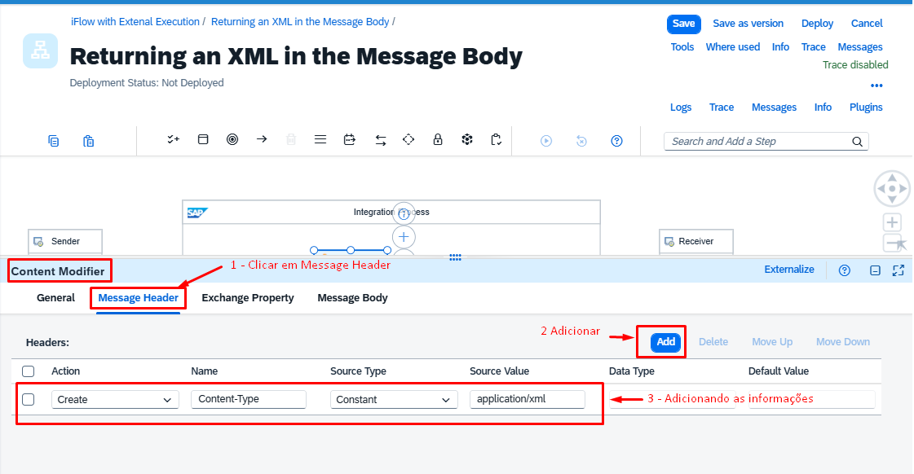

### Adicionando o Filter ao nosso Iflow
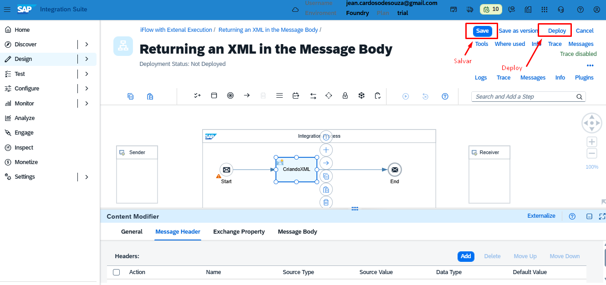

### Renomeando o Filter para Filter XML
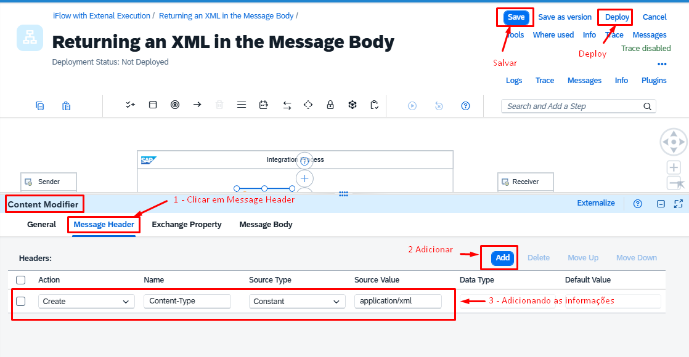

### Realizando o Filter 
Nesta etapa iremos colocar o caminho do XML que queremos filtrar

> Filter - Processing

```
XPath Expression: /empregados/empregado[estado = 'SP']
```
📌 Importante:
XPath não transforma XML, ele apenas seleciona nós.

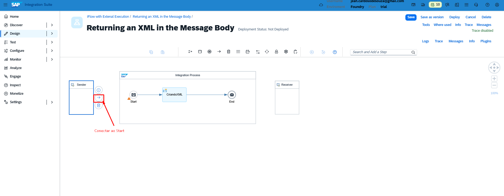

### Arquivo do empregados.xml

``` empregados.xml
<?xml version='1.0' encoding='UTF-8'?>
<empregados>
</empregados>

```
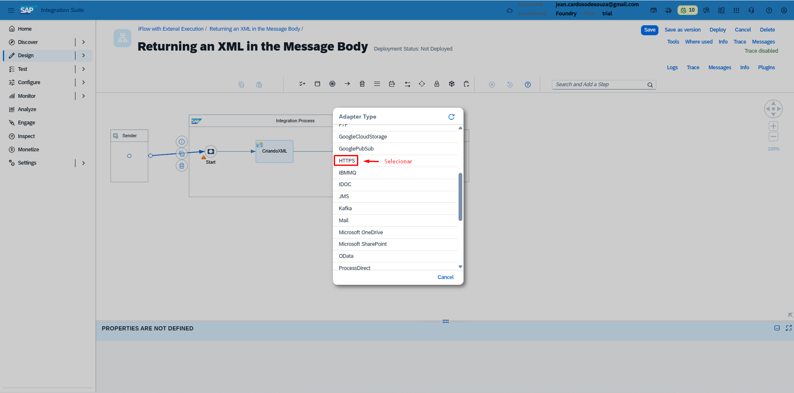

### Selecionando Conector
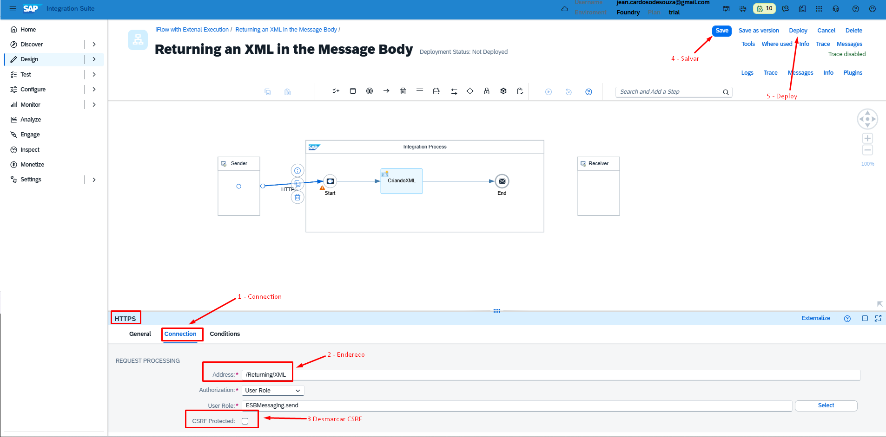

### Clicar no icone de iniciar Simulação
Para adicionar nosso XML
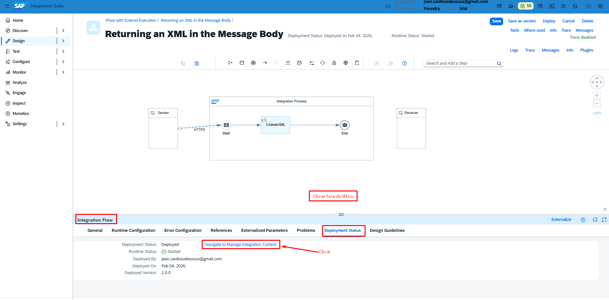

### Adicionando o conteúdo do empregados.xml
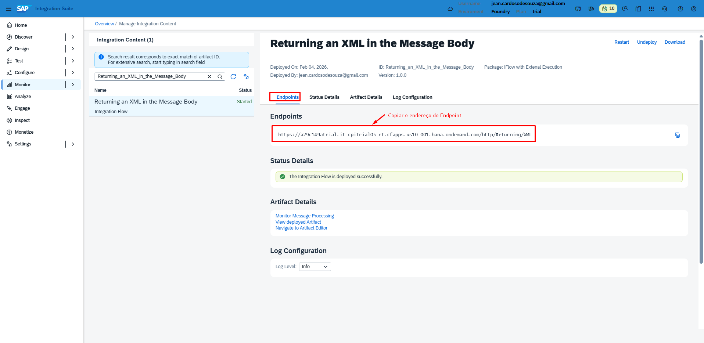

### Clicar no Conector e adicionar o End Simulação
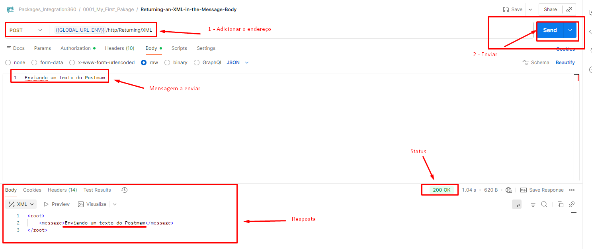

### Clicar para iniciar nossos teste de simulação


### Clicar no Envelope para ver o resultado


### Resultado com o filtro do XML
Com todos os dados que são do estado de SP


### XML do resultado


``` Resultado do Filtro de SP
<?xml version='1.0' encoding='UTF-8'?>
<empregados>
  </empregados>
```


## 📦 Exemplo prático – iFlow para baixar

📦 [Download do iFlow – Package/FilterwithXML.zip](Package/FilterwithXML.zip)


> O arquivo pode ser importado diretamente no SAP Integration Suite (CPI).
